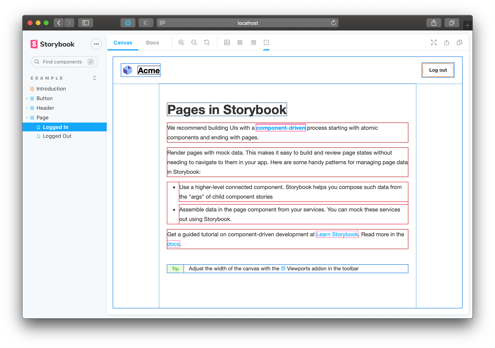

Almost there. So far, we created a tool, added it to the toolbar and it even tracks state. We now need to respond to this state and show/hide the outlines.

[Decorators](https://storybook.js.org/docs/react/writing-stories/decorators) wrap stories and add-in extra rendering functionality. We are going to create a decorator that responds to the outline global and handles CSS injection. Which in turn, draw outlines around all HTML elements.

In the previous step we defined the `outlineActive` global, let's wire it up! We can consume globals in a decorator using the `useGlobals` hook.

```js:title=src/withGlobals.js
/* eslint-env browser */
import { useEffect, useGlobals } from '@storybook/addons';

export const withGlobals = (StoryFn, context) => {
  const [{ outlineActive }, updateGlobals] = useGlobals();
  // Is the addon being used in the docs panel
  const isInDocs = context.viewMode === 'docs';

  useEffect(() => {
    // Execute your side effect here
    // For example, to manipulate the contents of the preview
    const selectorId = isInDocs ? `#anchor--${context.id} .docs-story` : `root`;

    displayToolState(selectorId, { outlineActive, isInDocs });
  }, [outlineActive]);

  return StoryFn();
};

function displayToolState(selector, state) {
  const rootElement = document.getElementById(selector);
  let preElement = rootElement.querySelector('pre');

  if (!preElement) {
    preElement = document.createElement('pre');
    preElement.style.setProperty('margin-top', '2rem');
    preElement.style.setProperty('padding', '1rem');
    preElement.style.setProperty('background-color', '#eee');
    preElement.style.setProperty('border-radius', '3px');
    preElement.style.setProperty('max-width', '600px');
    rootElement.appendChild(preElement);
  }

  preElement.innerText = `This snippet is injected by the withGlobals decorator.
It updates as the user interacts with the ⚡ tool in the toolbar above.
${JSON.stringify(state, null, 2)}
`;
}
```

## Injecting the outline CSS

Adding and clearing styles is a side-effect, therefore, we need to wrap that operation in `useEffect`. Which in turn is triggered by the `outlineActive` global. The Kit code comes with an example but, let's update it to handle the outline CSS injection.

```js:title=src/withGlobals.js
/* eslint-env browser */
import { useEffect, useMemo, useGlobals } from '@storybook/addons';

import { clearStyles, addOutlineStyles } from './helpers';
import outlineCSS from './outlineCSS';

export const withGlobals = (StoryFn, context) => {
  const [{ outlineActive }, updateGlobals] = useGlobals();
  // Is the addon being used in the docs panel
  const isInDocs = context.viewMode === 'docs';

  const outlineStyles = useMemo(() => {
    const selector = isInDocs ? `#anchor--${context.id} .docs-story` : '.sb-show-main';

    return outlineCSS(selector);
  }, [context.id]);

  useEffect(() => {
    const selectorId = isInDocs ? `addon-outline-docs-${context.id}` : `addon-outline`;

    if (!isActive) {
      clearStyles(selectorId);
      return;
    }

    addOutlineStyles(selectorId, outlineStyles);

    return () => {
      clearStyles(selectorId);
    };
  }, [isActive, outlineStyles, context.id]);
};
```

Ok, that seems like a big jump. Let’s walk through all the changes.

The addon can be active in both docs and story view modes. The actual DOM node for the preview `iframe` is different in these two modes. In fact, the docs mode renders multiple story previews on one page. Therefore, we need to pick the appropriate selector for the DOM node where the styles will be injected. Also, the CSS needs to be scoped to that particular selector.

<div class="aside"><b>Note:</b> the <code>useMemo</code> and <code>useEffect</code> here come from <a href="https://storybook.js.org/docs/react/addons/addons-api">@storybook/addons</a> and not React. This is because the decorator code is running in the preview part of Storybook. That's where the user's code is loaded which may not contain React. Therefore, to be framework agnostic, Storybook implements a React-like hook library which we can use!</div>

Next, as we inject the styles into the DOM, we need to keep track of them to clear them when the user toggles it off or switches the view mode.

To manage all this CSS logic, we need a few helpers. These use DOM APIs to inject and remove stylesheets.

```js:title=src/helpers.js
/* eslint-env browser */
export const clearStyles = selector => {
  const selectors = Array.isArray(selector) ? selector : [selector];
  selectors.forEach(clearStyle);
};

const clearStyle = selector => {
  const element = document.getElementById(selector);
  if (element && element.parentElement) {
    element.parentElement.removeChild(element);
  }
};

export const addOutlineStyles = (selector, css) => {
  const existingStyle = document.getElementById(selector);
  if (existingStyle) {
    if (existingStyle.innerHTML !== css) {
      existingStyle.innerHTML = css;
    }
  } else {
    const style = document.createElement('style');
    style.setAttribute('id', selector);
    style.innerHTML = css;
    document.head.appendChild(style);
  }
};
```

And the outline CSS itself is based on what [Pesticide](https://github.com/mrmrs/pesticide) uses. Grab it from [outlineCSS.js](https://github.com/chromaui/learnstorybook-addon-code/blob/main/src/outlineCSS.js) file.

All together, this enables us to draw outlines around the UI elements.


