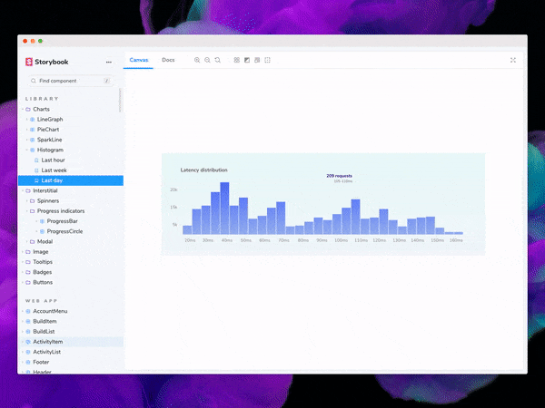

This guide is made for <b>professional developers</b> learning how to build Storybook addons. Intermediate experience in JavaScript and React is recommended. You should also know Storybook basics, such as writing a story and editing config files (<a href="/intro-to-storybook">Intro to Storybook</a> teaches basics).

 

Storybook is a tool for developing UI components outside your app in an isolated environment. Addons allow you to enhance and automate parts of this workflow. In fact, most of Storybook's core features are implemented as addons. For instance: [documentation](https://storybook.js.org/docs/react/writing-docs/introduction), [accessibility testing](https://storybook.js.org/addons/@storybook/addon-a11y) and [interactive controls](https://storybook.js.org/docs/react/essentials/controls), among others. There are also [over 200](https://storybook.js.org/addons) addons made by the community that unlock time-savings for UI developers.

## What are we going to build?

It's tough to tell if your CSS layout matches the design. Eyeballing alignment is tricky when DOM elements are far apart or have odd shapes.

The [Outline addon](https://storybook.js.org/addons/storybook-addon-outline) adds a toolbar button that outlines all UI elements, using CSS. That makes it easy to verify positioning and placement in a glance. Check out the example below.

## The anatomy of an addon

Addons allow you to extend what’s possible with Storybook. Everything from the interface to the APIs. They ⚡supercharge⚡ the UI development workflow.

There are two broad category of addons:

- **UI-based:** customize the interface, add shortcuts for repetitive tasks or format and display additional information. For instance: documentation, accessibility testing, interactive controls, and design previews.

- **Presets:** a collection of Storybook configurations that get applied automatically. These are often used to quickly pair Storybook with a specific technology. For example, the preset-create-react-app, preset-nuxt and preset-scss.

## UI-based addons

Addons can create three types of interface elements:

1. You can add a tool to the Toolbar, for example the [Grid and Background](https://storybook.js.org/docs/react/essentials/backgrounds) tools

2. Create an addon Panel similar to the [Actions addon](https://storybook.js.org/docs/react/essentials/actions) which displays a log of actions

3. Create a new Tab much like [Storybook Docs](https://storybook.js.org/docs/react/writing-docs/introduction) which displays the component documentation.

It’s clear that addons can do a lot. So what does our addon do?

The Outline addon allows a developer to click a button in the toolbar to draw outlines around each element in the story. When they click that button again, all the outlines are removed.

Our addon code has four parts that we'll cover in the next few chapters:

- **Addon UI** that creates the “tool” button in the toolbar. This is what the user clicks.
- **Registration** of the addon with Storybook.
- **State management** to track the toggle state of the tool. This controls whether the outlines are visible or not.
- **Decorator** that injects CSS in the preview iframe to draw the outlines.
