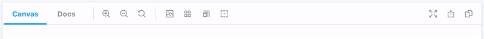

React has built in [hooks](https://reactjs.org/docs/hooks-state.html#gatsby-focus-wrapper), such as `useState`, to manage state. Usually, this would be enough. However, in this case things are slightly more complicated. Let’s take a moment to talk about how Storybook is architected.

## Basics of Storybook’s architecture


On the surface, Storybook presents a unified user interface. However, under the hood it’s divided into two segments that talk to each other across a **communication channel:**

- **A Manager:** the UI where Storybook’s search, navigation, toolbars, and addons are rendered.
- **Preview:** an iframe where the stories are rendered.

We need to track the toggle state **and** we also need to share that state across both the Manager and Preview. Therefore, instead of `useState` we are going to use `useGlobals` from `@storybook/api`.

## Track global state

[Globals](https://storybook.js.org/docs/react/essentials/toolbars-and-globals/#globals) represent the “global” (as in not story-specific) context in Storybook. They are a handy way to share information between different stories, addons and decorators. The `useGlobals` hook that allows you to access this global context within the tool that you’re building.

<div class="aside">Checkout <a href="https://storybook.js.org/docs/react/addons/addons-api">@storybook/addons</a> for more addons related APIs.</div>

The Addon Kit preconfigures the `Tool` to use globals. Let’s rename the global to more accurately reflect what it does. The `toggleOutline` function allows the user to actually toggle the outline addon on and off 👉🏽🔘



```diff:title=src/Tool.js
import React, { useCallback } from 'react';
import { useGlobals } from '@storybook/api';
import { Icons, IconButton } from '@storybook/components';
import { TOOL_ID } from './constants';

export const Tool = () => {
+  const [{ outlineActive }, updateGlobals] = useGlobals();

+  const toggleOutline = useCallback(
    () =>
      updateGlobals({
+        outlineActive: !outlineActive,
      }),
+    [outlineActive]
  );

  return (
    <IconButton
      key={TOOL_ID}
+      active={outlineActive}
      title="Apply outlines to the preview"
+      onClick={toggleOutline}
    >
      <Icons icon="outline" />
    </IconButton>
  );
};
```
