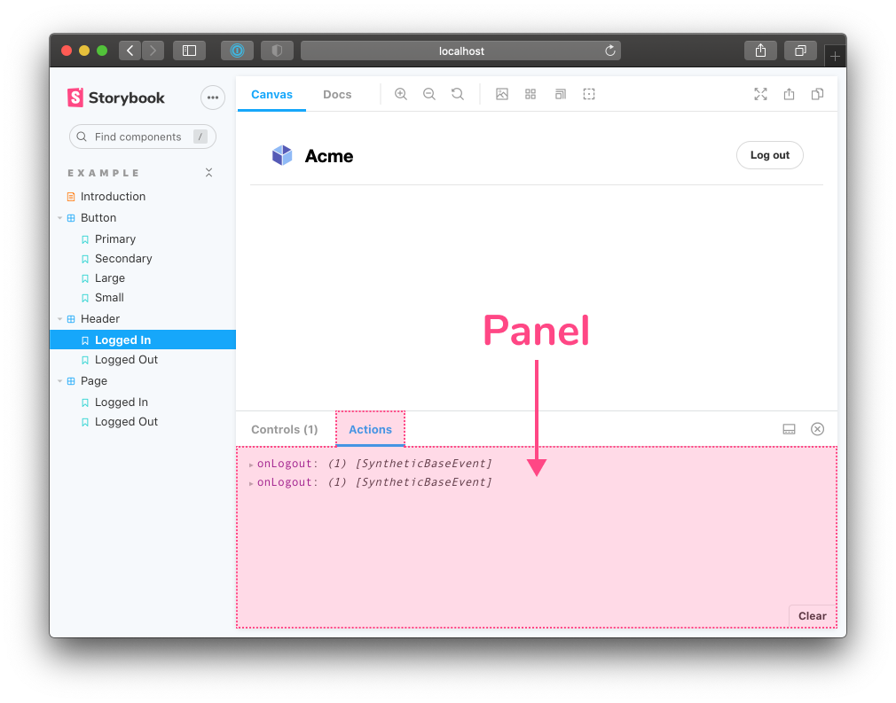
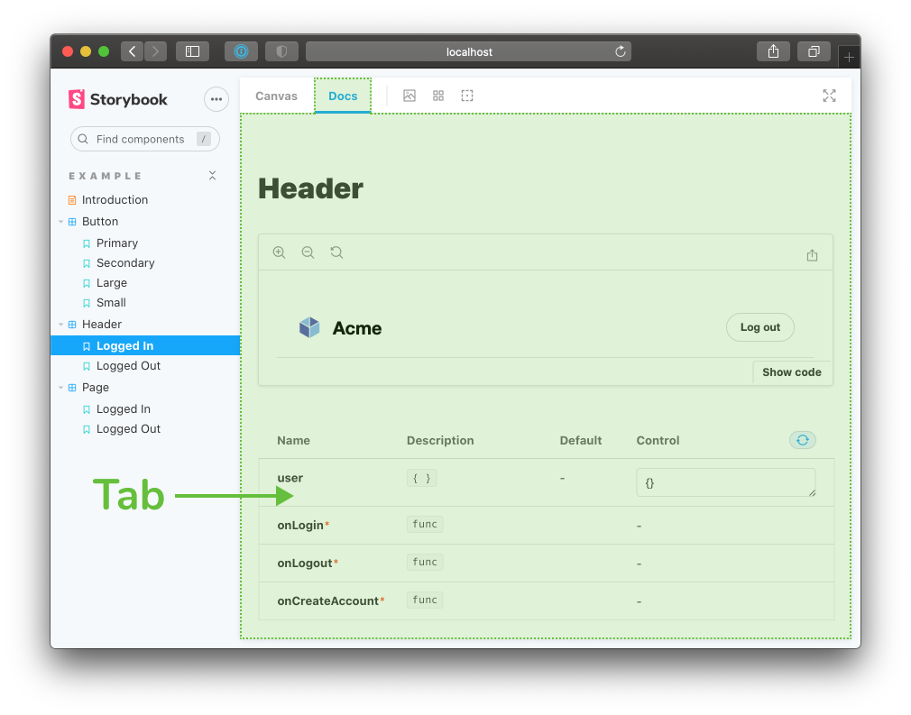

Esta guía está hecha para <b>desarrolladores profesionales</b> que quieran aprender a crear complementos de Storybook. Se recomienda experiencia intermedia en JavaScript y React. También debes conocer los conceptos básicos de Storybook, como escribir una historia y editar archivos de configuración (<a href="/intro-to-storybook">Intro to Storybook</a> teaches basics).

 

Storybook es una herramienta para desarrollar componentes de interfaz de usuario (UI) fuera de la aplicación en un entorno aislado. Los complementos permiten mejorar y automatizar partes de este flujo de trabajo. De hecho, la mayoría de las funciones principales de Storybook se implementan como complementos. Por ejemplo: [documentación](https://storybook.js.org/docs/react/writing-docs/introduction), [pruebas de accesibilidad](https://storybook.js.org/addons/@storybook/addon-a11y) y [controles interactivos](https://storybook.js.org/docs/react/essentials/controls), entre otros. También hay [más de 200](https://storybook.js.org/addons) complementos creados por la comunidad que permiten a los desarrolladores de UI ahorrar valioso tiempo.

  

## ¿Qué vamos a construir?

Es difícil saber si el diseño CSS coincide con el diseño general. La alineación visual es complicada cuando los elementos DOM están muy separados o tienen formas extrañas.

El complemento [Outline addon](https://storybook.js.org/addons/storybook-addon-outline) agrega un botón de barra de herramientas que describe todos los elementos de la interfaz de usuario, utilizando CSS. Eso hace que sea fácil de verificar el posicionamiento y la ubicación de un vistazo. Mira el ejemplo a continuación. 

## La anatomía de un complemento

Los complementos permiten ampliar las posibilidades de Storybook. Todo, desde la interfaz hasta las API. ⚡Aceleran⚡ el flujo de trabajo en el desarrollo de UI.

Hay dos amplias categorías  de complementos:

- **Basados en UI:** personalizan la interfaz, agregan accesos directos para tareas repetitivas o formatean y muestran información adicional. Por ejemplo: documentación, pruebas de accesibilidad, controles interactivos y vistas previas de diseño.

- **Preestablecidos:** una colección de configuraciones de Storybook que se aplican automáticamente. Estos se utilizan a menudo para emparejar rápidamente Storybook con una tecnología específica. Por ejemplo, preset-create-react-app, preset-nuxt y preset-scss.

## Basados en UI

Los complementos pueden crear tres tipos de elementos de interfaz:

1. Se puede agregar una herramienta a la barra de herramientas, por ejemplo las herramientas para la Cuadrícula y el Fondo  [Grid and Background](https://storybook.js.org/docs/react/essentials/backgrounds) tools

2. Se puede crear un panel de complementos similar al [Actions addon](https://storybook.js.org/docs/react/essentials/actions) que muestra un registro de las acciones

3. Se puede crear una nueva pestaña similar a [Storybook Docs](https://storybook.js.org/docs/react/writing-docs/introduction) que muestra la documentación del componente.

Queda claro que los complementos pueden hacer mucho. Entonces, ¿qué hace nuestro complemento?

El complemento Outline permite al desarrollador hacer clic en un botón de la barra de herramientas para dibujar contornos alrededor de cada elemento de la historia. Cuando se vuelve a hacer clic en ese botón, se eliminan todos los contornos.

El código de nuestro complemento tiene cuatro partes que cubriremos en los próximos capítulos:

- **Addon UI** crea el botón "herramienta" en la barra de herramientas. Aqui hace clic el usuario.
- **Registro**  del complemento con Storybook.
- **Gestión de estado** para rastrear el estado de alternancia de la herramienta. Esto controla si los contornos son visibles o no.
- **Decorador** que inyecta CSS en el iframe de vista previa para dibujar los contornos.

 
 