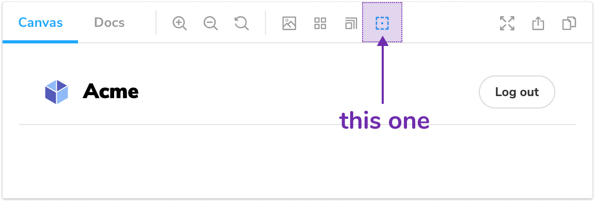

Empecemos por el archivo `src/Tool.js`. Aquí es donde vivirá el código UI de la herramienta Outline. Observa la importación de [@storybook/components](https://www.npmjs.com/package/@storybook/components). Esta es la biblioteca de componentes propia de Storybooks, construida con React y Emotion. Se usa para construir, bueno, el propio Storybook ([demo](https://next--storybookjs.netlify.app/official-storybook/)). También podemos usarlo para construir nuestro complemento.

En este caso, usaremos los componentes `Icons` y `IconButton` para crear la herramienta de selección de contorno. Modifica tu código para usar el ícono `outline` y dale un título apropiado.

```js:title=src/Tool.js
import React, { useCallback } from 'react';
import { useGlobals } from '@storybook/api';
import { Icons, IconButton } from '@storybook/components';
import { TOOL_ID } from './constants';

export const Tool = () => {
  const [{ myAddon }, updateGlobals] = useGlobals();

  const toggleMyTool = useCallback(
    () =>
      updateGlobals({
        myAddon: !myAddon,
      }),
    [myAddon]
  );

  return (
    <IconButton
      key={TOOL_ID}
      active={myAddon}
      title="Aplicar contorno a la vista previa"
      onClick={toggleMyTool}
    >
      <Icons icon="outline" />
    </IconButton>
  );
};
```

Pasando a manager.js, aquí registramos el complemento con Storybook usando un archivo único `ADDON_ID`. También registramos la herramienta con una identificación única. Recomendamos algo como `storybook/addon-nombre`. El kit Addon también incluye ejemplos de pestañas y paneles. El complemento Outline solo usa una herramienta, por lo que podemos eliminar las demás.

```js:title=src/preset/manager.js
import { addons, types } from '@storybook/addons';

import { ADDON_ID, TOOL_ID } from '../constants';
import { Tool } from '../Tool';

// Registrar wl complemento
addons.register(ADDON_ID, () => {
  // Registrar la herramienta
  addons.add(TOOL_ID, {
    type: types.TOOL,
    title: 'Mi complemento',
    match: ({ viewMode }) => !!(viewMode && viewMode.match(/^(story|docs)$/)),
    render: Tool,
  });
});
```

Observa la propiedad 'match'. Permite controlar en qué modo de visualización se habilitará el complemento. En este caso, el complemento estará disponible en el modo historia y documentación.

En este punto, deberías ver la herramienta de selección de contorno en la barra de herramientas 🎉


