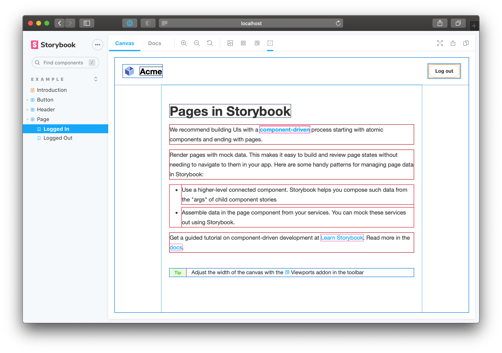

Nous y sommes presque. Jusque là, nous avons créé un outil, nous l'avons ajouté à la barre d'outils et il suit même son état. Nous devons maintenant appliquer cet état et afficher ou masquer les contours.

Les [décorateurs](https://storybook.js.org/docs/react/writing-stories/decorators) englobent les stories et ajoutent des fonctionnalités au rendu. Nous allons créer un décorateur qui réagit à la globale de contour et gère l'injection de CSS affichant des contours autour de tous les éléments HTML.

Dans l'étape précédente, nous avons défini la globale `outlineActive`, branchons-la ! Nous pouvons consommer les globales dans un décorateur en utilisant le hook `useGlobals`.

```js:title=src/withGlobals.js
/* eslint-env browser */
import { useEffect, useGlobals } from '@storybook/addons';

export const withGlobals = (StoryFn, context) => {
  const [{ outlineActive }, updateGlobals] = useGlobals();
  // L'addon est-il utilisé dans le panneau Docs ?
  const isInDocs = context.viewMode === 'docs';

  useEffect(() => {
    // Exécutez votre effet de bord ici
    // Pour manipuler le contenu de la prévisualisation, par exemple
    const selectorId = isInDocs ? `#anchor--${context.id} .docs-story` : `root`;

    displayToolState(selectorId, { outlineActive, isInDocs });
  }, [outlineActive]);

  return StoryFn();
};

function displayToolState(selector, state) {
  const rootElement = document.getElementById(selector);
  let preElement = rootElement.querySelector('pre');

  if (!preElement) {
    preElement = document.createElement('pre');
    preElement.style.setProperty('margin-top', '2rem');
    preElement.style.setProperty('padding', '1rem');
    preElement.style.setProperty('background-color', '#eee');
    preElement.style.setProperty('border-radius', '3px');
    preElement.style.setProperty('max-width', '600px');
    rootElement.appendChild(preElement);
  }

  preElement.innerText = `Ce snippet est injecté par le décorateur withGlobals.
Il s'actualise lorsque l'utilisateur interagit avec l'outil ⚡ de la barre d'outils ci-dessus.
${JSON.stringify(state, null, 2)}
`;
}
```

## Injecter le CSS affichant les contours

Ajouter et nettoyer des styles est un effet de bord. Par conséquent, nous devons englober cette opération dans `useEffect`. Cette dernière étant déclenchée par la globale `outlineActive`. L'Addon Kit fournit un exemple, mais modifions-le afin d'appliquer l'injection de CSS pour afficher les contours.

```js:title=src/withGlobals.js
/* eslint-env browser */
import { useEffect, useMemo, useGlobals } from '@storybook/addons';

import { clearStyles, addOutlineStyles } from './helpers';
import outlineCSS from './outlineCSS';

export const withGlobals = (StoryFn, context) => {
  const [{ outlineActive }, updateGlobals] = useGlobals();
  // L'addon est-il utilisé dans le panneau Docs ?
  const isInDocs = context.viewMode === 'docs';

  const outlineStyles = useMemo(() => {
    const selector = isInDocs ? `#anchor--${context.id} .docs-story` : '.sb-show-main';

    return outlineCSS(selector);
  }, [context.id]);

  useEffect(() => {
    const selectorId = isInDocs ? `addon-outline-docs-${context.id}` : `addon-outline`;

    if (!outlineActive) {
      clearStyles(selectorId);
      return;
    }

    addOutlineStyles(selectorId, outlineStyles);

    return () => {
      clearStyles(selectorId);
    };
  }, [outlineActive, outlineStyles, context.id]);

  return StoryFn();
};
```

Ok, ça fait beaucoup là, non ? Parcourons les modifications.

L'addon peut être activé à la fois dans les modes docs et story. Le nœud du DOM, correspondant à l'`iframe` de prévisualisation, est différent selon ces deux modes. En fait, le mode docs affiche plusieurs prévisualisations de stories sur une même page. Nous devons donc choisir un sélecteur approprié pour déterminer où nos styles seront injectés. De plus, le CSS doit être spécifiquement ciblé sur ce sélecteur.

<div class="aside"><b>Note :</b> <code>useMemo</code> et <code>useEffect</code> sont fournis par <a href="https://storybook.js.org/docs/react/addons/addons-api">@storybook/addons</a> et non par React car le code du décorateur s'exécute dans la partie prévisualisation de Storybook. C'est là qu'est chargé le code de l'utilisateur et celui-ci n'est pas forcément du React. Par conséquent, afin de rester indépendant de quelque framework qu'il soit, Storybook nous met à disposition une bibliothèque de hooks similaire à React !</div>

Ensuite, tandis que nous injectons nos styles dans le DOM, nous devons en garder une trace afin de les retirer lorsque l'utilisateur les désactive ou change de mode.

Pour gérer toute cette logique CSS, nous avons besoin d'helpers. Ils utilisent les APIs du DOM pour injecter et retirer les feuilles de style.

```js:title=src/helpers.js
/* eslint-env browser */
export const clearStyles = selector => {
  const selectors = Array.isArray(selector) ? selector : [selector];
  selectors.forEach(clearStyle);
};

const clearStyle = selector => {
  const element = document.getElementById(selector);
  if (element && element.parentElement) {
    element.parentElement.removeChild(element);
  }
};

export const addOutlineStyles = (selector, css) => {
  const existingStyle = document.getElementById(selector);
  if (existingStyle) {
    if (existingStyle.innerHTML !== css) {
      existingStyle.innerHTML = css;
    }
  } else {
    const style = document.createElement('style');
    style.setAttribute('id', selector);
    style.innerHTML = css;
    document.head.appendChild(style);
  }
};
```

Ce CSS affichant les contours est basé sur ce qu'utilise [Pesticide](https://github.com/mrmrs/pesticide). Vous pouvez le récupérer dans le fichier [outlineCSS.js](https://github.com/chromaui/learnstorybook-addon-code/blob/main/src/outlineCSS.js).

Tout ceci nous permet d'afficher les contours autour des éléments UI.


