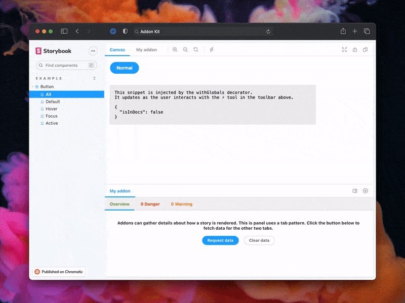
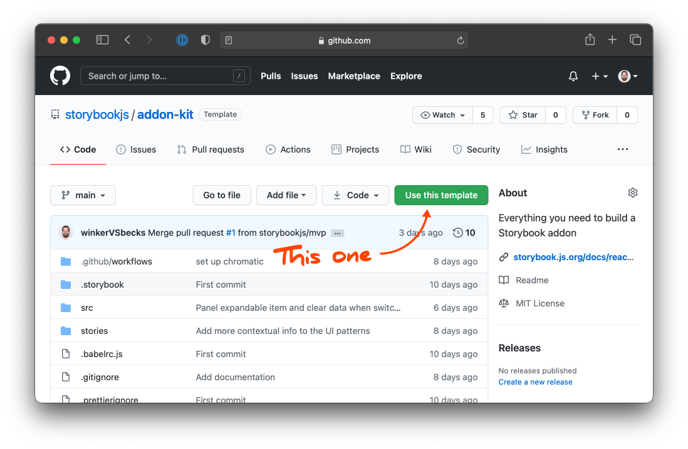

Nous utiliserons l'[Addon Kit](https://github.com/storybookjs/addon-kit) pour initialiser notre projet. Il fournit tout ce dont vous avez besoin pour la création d'un addon Storybook :

- 📝 Edition en direct en mode développement
- ⚛️ Support React/JSX pour l'UI
- 📦 Transpilation et bundling avec [Babel](http://babeljs.io/)
- 🏷 Métadonnées de plugin
- 🚢 Gestion de releases avec [Auto](https://github.com/intuit/auto)

Pour commencer, cliquez sur le bouton **Use this template** sur le [dépôt de l'Addon Kit](https://github.com/storybookjs/addon-kit). Cela créera un nouveau dépôt pour vous comprenant l'ensemble du code de l'Addon Kit.



Ensuite, clonez votre dépôt et installez les dépendances.

```bash
npm install
# Utiliser la commande suivante pour npm 7
npm i --legacy-peer-deps
```

Enfin, lancez le mode développement afin de démarrer Storybook et Babel en mode watch.

```bash
npm run start
```

Le code de l'addon se situe dans le répertoire `src`. L'exemple montre le fonctionnement des trois paradigmes UI et d'autres concepts comme la gestion d'état et comment interagir avec une story. Nous y reviendrons plus en détail dans les prochaines sections.
