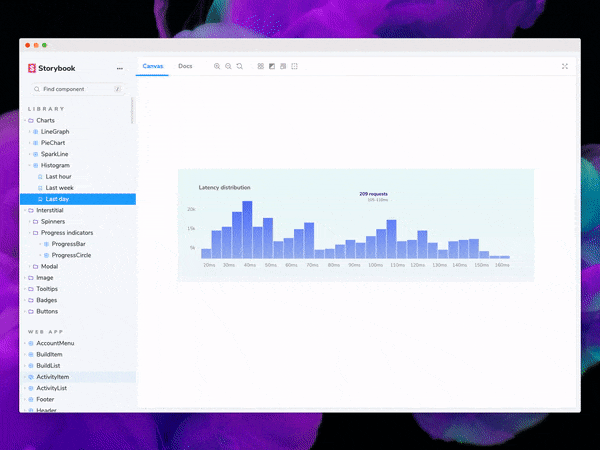
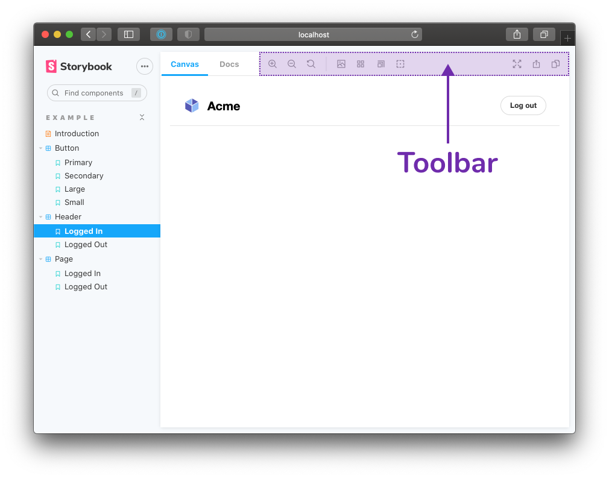
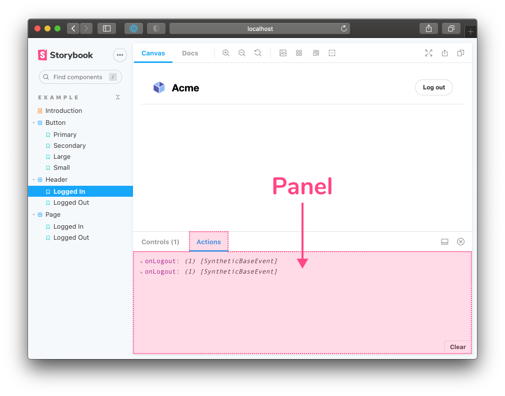
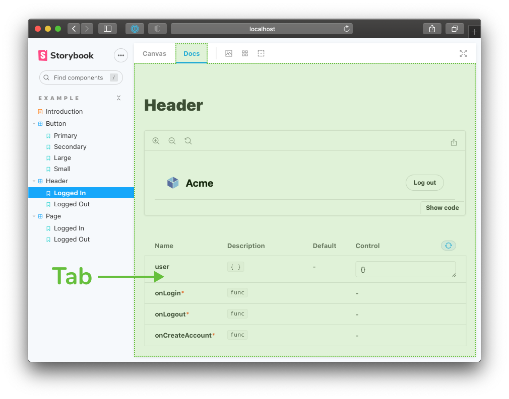

Ce guide est destiné aux <b>développeurs professionnels</b> souhaitant apprendre à créer un addon pour Storybook. Une certaine expérience en JavaScript et avec React est recommandée. Il est également recommandé de connaître les bases de Storybook telles que la rédaction d'une story et la modification des fichiers de configuration (ces bases sont enseignées dans <a href="/intro-to-storybook">Intro to Storybook</a>).

 

Storybook est un outil permettant de développer des composants UI dans un environnement isolé hors de votre application. Les addons vous permettent d'améliorer et d'automatiser certaines parties de ce workflow. En fait, la plupart des fonctionnalités propres à Storybook sont implémentées en tant qu'addons. C'est entre autres le cas de la [documentation](https://storybook.js.org/docs/react/writing-docs/introduction), des [tests d'accessibilité](https://storybook.js.org/addons/@storybook/addon-a11y) et des [contrôles interactifs](https://storybook.js.org/docs/react/essentials/controls). Il existe également [plus de 200](https://storybook.js.org/addons) addons développés par la communauté qui offrent un gain de temps pour les développeurs UI.

## Qu'allons-nous développer ?

Il est difficile de déterminer qu'une mise en page CSS est bien conforme au design. Évaluer à l'œil le bon alignement des éléments du DOM devient compliqué lorsque ceux-ci sont éloignés les uns des autres ou ont des formes particulières.

L'[addon Outline](https://storybook.js.org/addons/storybook-addon-outline) ajoute un bouton à la barre d'outils permettant d'ajouter un contour à tous les éléments UI grâce à du CSS. Cela facilite la vérification de leur positionnement et de leur placement en un coup d'œil. Voyez l'exemple ci-dessous :

## L'anatomie d'un addon

Les addons vous permettent d'étendre les possibilités de Storybook, de son interface à ses APIs. Ils ⚡boostent⚡ le workflow du développement UI.

Il y a deux sortes d'addons :

- **Les addons liés à l'UI:** personnaliser l'interface, ajouter des raccourcis pour des tâches répétitives ou mettre en forme et afficher des informations complémentaires. Par exemple : mise en place de documentation, de tests d'accessibilité, de contrôles interactifs ou de prévisualisations du design.

- **Presets:** une collection de configurations Storybook appliquées automatiquement. Elles sont souvent utilisées pour coupler Storybook à une technologie spécifique. Par exemple : preset-create-react-app, preset-nuxt et preset-scss.

## Addons liés à l'UI

Les addons peuvent créer trois types d'éléments d'interface :

1. Un outil dans la barre d'outils, comme par exemple les outils [Grid et Background](https://storybook.js.org/docs/react/essentials/backgrounds).

2. Un panneau à l'image de l'[addon Actions](https://storybook.js.org/docs/react/essentials/actions) qui permet d'afficher un journal d'actions.

3. Un nouvel onglet comme [Storybook Docs](https://storybook.js.org/docs/react/writing-docs/introduction) qui permet d'afficher la documentation d'un composant.

Il est clair que les addons peuvent faire beaucoup de choses. Que fait donc le nôtre ?

L'addon Outline permet d'appliquer un contour à tous les éléments d'une story lors d'un clic sur un bouton dans la barre d'outils. Cliquer à nouveau sur le bouton permet de retirer ces contours.

Le code de notre addon est composé de quatre parties que nous couvrirons dans les chapitres suivants :

- **L'UI de l'addon** qui crée le bouton dans la barre d'outils, l'élément sur lequel l'utilisateur clique.
- **L'enregistrement** de l'addon dans Storybook.
- **La gestion d'état** pour suivre l'état actif/inactif de l'outil, contrôlant l'affichage ou non des contours.
- **Le décorateur** injectant le CSS dans l'iframe de prévisualisation afin d'afficher les contours.
