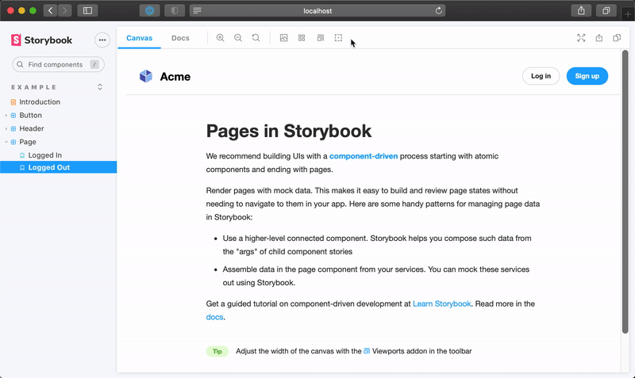

Maintenant que nous nous sommes occupés du décorateur, utilisons un preset pour qu'il englobe chaque story.

Les presets vous permettent de combiner différentes configurations Storybook et de les appliquer d'un seul coup. Certains addons se chargent uniquement de configurer Storybook et n'ont aucune UI. Par exemple <a href="https://www.npmjs.com/package/@storybook/preset-create-react-app">preset-create-react-app</a> et <a href="https://www.npmjs.com/package/storybook-preset-nuxt">preset-nuxt</a>. Ce sont ce qu'on appelle des <a href="https://storybook.js.org/docs/react/addons/writing-presets">addons Preset</a>.

Notre preset est divisé en deux parties :

1. `manager.js` pour enregistrer l'addon
2. `preview.js` pour définir des décorateurs globaux

Modifiez la prévisualisation afin de n'utiliser que le décorateur `withGlobals` pour l'appliquer automatiquement à toutes les stories.

```js:title=src/preset/preview.js
import { withGlobals } from '../withGlobals';

export const decorators = [withGlobals];
```

<div class="aside"><b>Note :</b> Le décorateur <code>withRoundTrip</code> de l'Addon Kit est un exemple de communication bidirectionnelle entre une story et un addon. Cependant, nous n'en avons pas besoin dans notre addon. Nous pouvons donc le supprimer</div>

Succès ! Vous avez désormais un addon parfaitement fonctionnel sur votre Storybook local. Dans le chapitre final, apprenez à répertorier votre addon dans le catalogue pour le partager à votre équipe et à la communauté Storybook.


