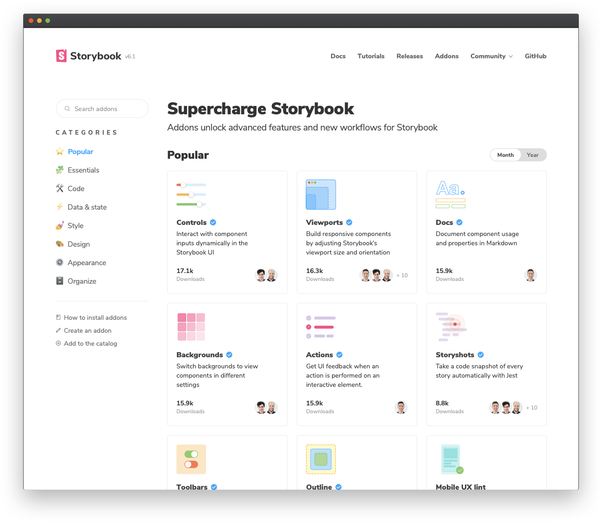
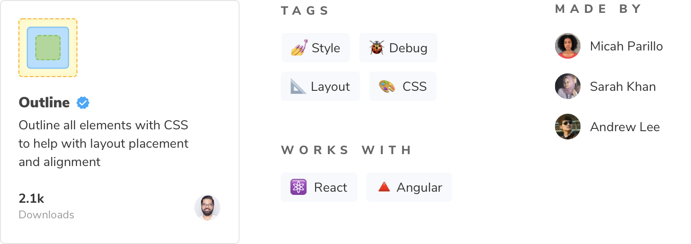

[애드온(addon) 카탈로그](https://storybook.js.org/addons)는 모든 스토리북(Storybook) 애드온의 메인화면 입니다. 새로운 애드온을 진열하고, 개발자들이 발견할 수 있는 곳입니다. 애드온 배포를 준비를 해고 패키지화 해서 카탈로그에 출시해보세요.



## 애드온 배포를 위한 준비

자바스크립트 생태계의 대부분의 패키지와 같이 스토리북 애드온은 npm을 통해 배포할 수 있습니다. 하지만 이에 대해 특정한 표준이 있습니다:

1. 트랜스파일된 ES5 코드가 포함된 dist 폴더를 가지고 있어야 합니다.
2. ES5 모듈로 작성한 `preset.js`파일이 최상위 단계에 있어야 합니다.
3. `package.json`파일이 다음을 선언해야 합니다:
   - Peer-dependencies
   - 모듈과 관련된 정보
   - 카탈로그 메타데이터

애드온 키트는 대부분을 다뤄줍니다. 개발자는 단순히 적절한 메타데이터를 제공하는 것을 보장하면 됩니다.

## 모듈 메타데이터

첫번째 항목은 메타데이터와 관련된 모듈입니다. 이것은 모듈의 주 진입점(main entry point)과 애드온을 게재할 때 포함할 파일, 애드온의 모든 peer-dependency 파일들로 구성되어 있습니다. 예를 들어, 리액트와 리액트돔 등과 스토리북과 관련된 모든 API들이 해당됩니다.

```json:title=package.json
{
  ...
  "main": "dist/preset.js",
  "files": [
    "dist/**/*",
    "README.md",
    "*.js"
  ],
  "peerDependencies": {
    "@storybook/addons": "^6.1.14",
    "@storybook/api": "^6.1.14",
    "@storybook/components": "^6.1.14",
    "@storybook/core-events": "^6.1.14",
    "@storybook/theming": "^6.1.14",
    "react": "^16.8.0 || ^17.0.0",
    "react-dom": "^16.8.0 || ^17.0.0"
  },
  ...
}
```

#### 왜 peer-dependencies 일까요?

리액트(React)에서 작동하는 라이브러리를 구축한다고 가정해 보세요. 리액트를 의존성 파일(dependency)에 포함하면 리액트 코드는 라이브러리와 함께 패키지화 됩니다. 라이브러리를 설치하는 사람들은 이미 코드 내에 리액트를 설치한 상태입니다. 다른 버전을 실행시키면 앱이 중단됩니다. 애드온에서도 비슷한 개념이 적용됩니다.

## 카탈로그 메타 데이터

모듈과 관련된 정보에 따라 스토리북 애드온 카탈로그에 대한 메타 데이터를 지정해주어야 합니다.



이러한 정보 중 일부는 애드온 키트에 미리 구성되어 있습니다. 표시되는 이름, 아이콘 혹은 프레임워크 호환성과 같은 항목은 스토리북 속성을 통해 지정할 수 있습니다. 메타 데이터의 모든 사양은 [애드온 메타 데이터 문서](https://storybook.js.org/docs/react/addons/addon-catalog/#addon-metadata)를 참고해주세요.

```json:title=package.json
{
  ...
  "name": "my-storybook-addon",
  "version": "1.0.0",
  "description": "My first storybook addon",
  "author": "Your Name",
  "storybook": {
    "displayName": "My Storybook Addon",
    "unsupportedFrameworks": ["react-native"],
    "icon": "https://yoursite.com/link-to-your-icon.png"
  },
  "keywords": ["storybook-addons", "appearance", "style", "css", "layout", "debug"]
  ...
}
```

여기서 키워드 속성은 카탈로그의 태그에 대응됩니다. 예를 들어, 스토리북 애드온 태그는 애드온이 카탈로그에 포함되도록 합니다. appearance는 최상위 단계 항목입니다. 나머지는 애드온을 검색하는 데에 도움을 주는 역할을 합니다.

## NPM에 출시하기

마지막 단계는 애드온을 실제로 출시하는 일입니다. 애드온 키트는 배포 관리를 위해 사전에 [Auto](https://github.com/intuit/auto) 패키지로 구성되어 있습니다. 변경 내역을 만들고 깃허브(GitHub)와 npm에 push 해보세요. 그러기 위해서는 두 가지 모두에 대해 접근권한을 설정해야 합니다.

1. [npm adduser](https://docs.npmjs.com/cli/adduser.html)를 사용해 인증하기
2. [액세스 토큰](https://docs.npmjs.com/creating-and-viewing-access-tokens#creating-access-tokens)을 생성하기. _읽기와 쓰기_ 권한이 모두 있는 토큰이 필요합니다.
3. 마찬가지로 [깃허브 토큰](https://github.com/settings/tokens)을 생성하기. 이 토큰에는 레포지토리 범위가 필요합니다.
4. 프로젝트 최상위 위치에 `.env`파일을 생성하고, 다음 토큰을 모두 추가하기:

```TEXT:title=.env
GH_TOKEN=깃허브에서 받아오는 토큰
NPM_TOKEN=npm에서 받아오는 토큰
```

다음으로, **깃허브에서 라벨을 생성해보세요**. 나중에 패키지를 변경할 때 이 라벨을 사용하게 됩니다.

```shell
npx auto create-labels
```

깃허브를 확인해보면, Auto 패키지에서 사용할 수 있는 라벨의 모음을 볼 수 있습니다. 이러한 태그를 사용해서 나중에 pull request를 할 수 있습니다.

마지막으로, 배포 단계 입니다.

```shell
yarn release
```

순서는 다음과 같습니다:

- 애드온 코드를 빌드해서 패키지하기
- 버전을 올리기
- 깃허브와 npm에 배포하기 위해 push 하기
- 깃허브에 변경 내역을 push하기

해냈습니다! 성공적으로 패키지를 npm에 출시하고 첫번째 스토리북 애드온을 배포했습니다. npm을 크롤링 하기 때문에 출시한 애드온에 카탈로그에 나타나는 데는 시간이 좀 걸릴 수 있습니다. 애드온이 카탈로그에서 보이지 않는다면, 카탈로그 저장소에 이슈를 올려주세요.
