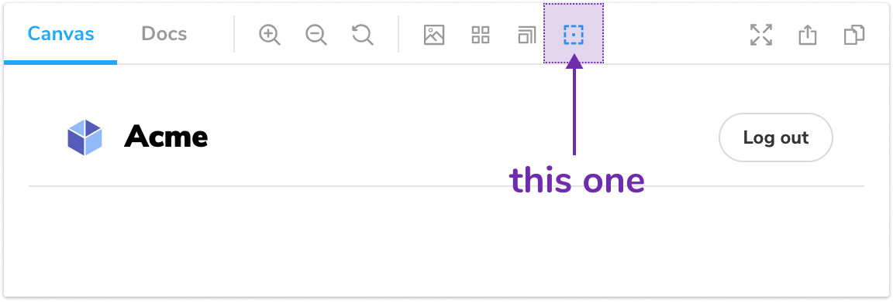

이 파일 `src/Tool.js` 에서 시작합시다. 이곳이 아웃라인 툴을 위한 UI 코드가 있을 곳입니다. 이 import를 [@storybook/components](https://www.npmjs.com/package/@storybook/components) 확인하세요. Storybook의 컴포넌트 라이브러리이며, 리액트와 이모션으로 만들어져 있습니다. Storybook을 만드는 자체에 사용되었기도 합니다 ([데모](https://next--storybookjs.netlify.app/official-storybook/)). 우리도 애드온을 만드는 데에 사용할 수 있습니다.

이번에는 `Icons` 와 `IconButton` 컴포넌트를 사용하여 아웃라인 선택자 툴을 만들겠습니다. 코드를 수정하고, `outline` 아이콘을 사용하여 적당한 제목을 줍니다.

```js:title=src/Tool.js
import React, { useCallback } from 'react';
import { useGlobals } from '@storybook/api';
import { Icons, IconButton } from '@storybook/components';
import { TOOL_ID } from './constants';

export const Tool = () => {
  const [{ myAddon }, updateGlobals] = useGlobals();

  const toggleMyTool = useCallback(
    () =>
      updateGlobals({
        myAddon: !myAddon,
      }),
    [myAddon]
  );

  return (
    <IconButton
      key={TOOL_ID}
      active={myAddon}
      title="Apply outlines to the preview"
      onClick={toggleMyTool}
    >
      <Icons icon="outline" />
    </IconButton>
  );
};
```

manger 파일로 이동해서, 애드온을 Storybook과 함께 고유 아이디로 `ADDON_ID` 등록합니다. 
툴 역시도 고유한 아이디와 함께 등록합니다. `storybook/addon-name`과 같은 이름을 추천드립니다. 애드온 키트 역시 탭과 패널 예시를 포함하고 있습니다. 아웃라인 애드온이 툴만을 사용하기 때문에, 나머지는 삭제합니다.


```js:title=src/preset/manager.js
import { addons, types } from '@storybook/addons';

import { ADDON_ID, TOOL_ID } from '../constants';
import { Tool } from '../Tool';

// Register the addon
addons.register(ADDON_ID, () => {
  // Register the tool
  addons.add(TOOL_ID, {
    type: types.TOOL,
    title: 'My addon',
    match: ({ viewMode }) => !!(viewMode && viewMode.match(/^(story|docs)$/)),
    render: Tool,
  });
});
```

프로퍼티의 짝을 확인하세요. 어떤 보기 모드에서 애드온이 활성화될지 통제할 수 있게 해줍니다. 이러한 경우에, 애드온은 스토리와 다큐먼트 모드에서 활성화될 것입니다.

지금 시점에서 당신은 아웃라인 선택자 툴을 툴바에서 볼 수 있어야 합니다 🎉


