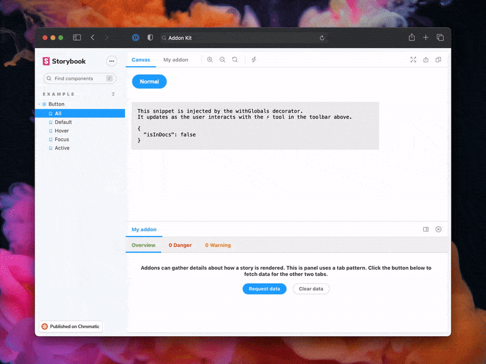
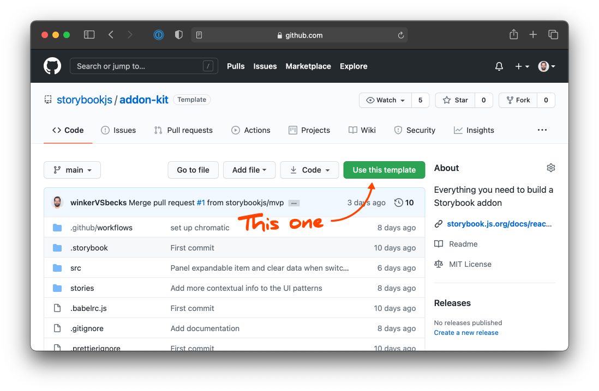

우리는 [애드온 키트](https://github.com/storybookjs/addon-kit) 를 사용하여 프로젝트를 부트스트랩 합니다. 
당신이 Storybook 애드온을 만들기 위해 필요한 모든 것을 제공합니다:

- 📝 개발 모드에서 실시간 편집
- ⚛️ UI를 위한 React/JSX 지원
- 📦 트랜스파일링과 번들링을 [Babel]과 함께(http://babeljs.io/)
- 🏷 플러그인 메타데이터
- 🚢 릴리즈 관리를 [Auto]와 함께(https://github.com/intuit/auto)

시작하기에 앞서, [애드온 키트 레포지토리](https://github.com/storybookjs/addon-kit)에서 **use thie template** 버튼을 클릭하세요.
새로운 레포지토리를 애드온 키트 코드와 함께 생성해줄 것입니다.



다음으로, 레포지토리를 클론하고 dependencies를 설치합니다.

```bash
yarn
```

애드온 키트는 기본으로 타입스크립트를 사용합니다. 어쨌거나, 우리는 eject command를 사용해서 보일러플레이트 코드를 자바스크립트로 바꿀 거에요. 이 튜토리얼의 목적을 위해서요.

```bash
yarn eject-ts
```

이 명령어는 모든 코드를 자바스크립트로 변형해줄 겁니다. 파괴적일 수 있는 과정이라, 이 명령어를 다른 어느 코드 작성을 시작하기전에 먼저 실행하기를 추천합니다.

마지막으로, 개발 모드를 시작합니다. Storybook을 시작하고 Babel을 보기 모드에서 볼 수 있습니다.

```bash
yarn start
```

애드온 코드는 'src' 디렉토리에 위치하고 있습니다. 포함된 보일러플레이트 코드는 세개의 UI 패러다임과 다른 개념들, 예를 들어 상태 관리나 스토리에 반응하기 등을 보여주고 있습니다. 다음 섹션에서 이것들을 세세하게 다룰 것입니다.
