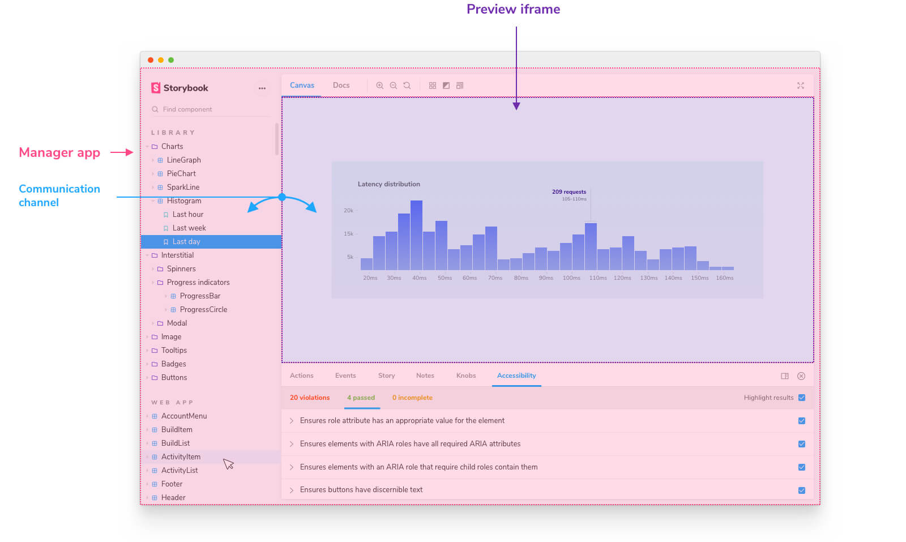
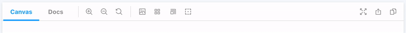

리액트(React)는 상태를 관리하기 위해 `useState` 같은 내장된 [훅](https://reactjs.org/docs/hooks-state.html#gatsby-focus-wrapper)이 있습니다. 일반적으로 이것으로 충분합니다만, 이 경우에는 상황이 조금 더 복잡합니다. 스토리북(Storybook)이 어떻게 설계되어 있는지를 이야기 해보겠습니다.

## 스토리북 구조의 기초



표면적으로 스토리북은 통합된 UI를 보여줍니다. 그러나 내부적으로는, **커뮤니케이션 채널을 통해 소통하는** 두 가지의 영역으로 나뉩니다.

- **A Manager:** 스토리북의 검색, 네비게이션, 툴바, 애드온이 렌더링되는 UI 입니다.
- **Preview:** 스토리들이 렌더링되는 iframe 입니다.

토글의 상태를 추적해야 하며 **또한** Manager와 Preview 모두에서 해당 상태를 공유해야 합니다. 이를 위해서 `useState` 대신 `@storybook/api`의 `useGlobals`를 사용하겠습니다.

## 전역 상태 추적하기

[전역](https://storybook.js.org/docs/react/essentials/toolbars-and-globals/#globals)은 스토리북에서 “전역” (스토리에 국한된 것이 아닌) 컨텍스트를 말합니다. 다양한 스토리와 애드온, 데코레이터 간 정보를 공유하기 편한 방법입니다. `useGlobals` 훅은 구축하고 있는 툴 내에서 전역 컨텍스트에 대한 접근할 수 있게 해줍니다.

<div class="aside">더 많은 애드온 관련 API는 <a href="https://storybook.js.org/docs/react/addons/addons-api">@storybook/addons</a>를 통해 확인하세요.</div>

애드온 키트는 전역을 사용하도록 `툴`을 사전에 설정합니다. 전역이 하는 역할을 보다 더 정확하게 반영하기 위해 전역의 이름을 변경해보겠습니다. `toggleOutline` 함수는 사용자가 아웃라인 애드온을 끄고 켤 수 있게 합니다. 👉🏽🔘



```diff:title=src/Tool.jsf
import React, { useCallback } from 'react';
import { useGlobals } from '@storybook/api';
import { Icons, IconButton } from '@storybook/components';
import { TOOL_ID } from './constants';

export const Tool = () => {
+  const [{ outlineActive }, updateGlobals] = useGlobals();

+  const toggleOutline = useCallback(
    () =>
      updateGlobals({
+        outlineActive: !outlineActive,
      }),
+    [outlineActive]
  );

  return (
    <IconButton
      key={TOOL_ID}
+      active={outlineActive}
      title="Apply outlines to the preview"
+      onClick={toggleOutline}
    >
      <Icons icon="outline" />
    </IconButton>
  );
};
```
